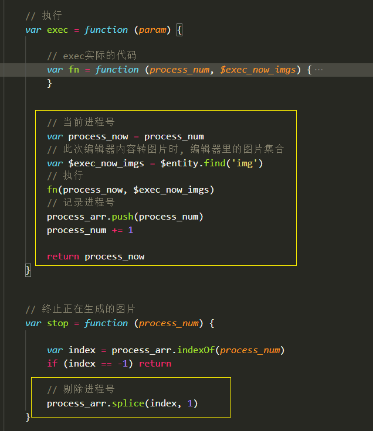

## 旺铺编辑器

### 快速开始

~~~html
<!DOCTYPE html>
<html lang="en">
<head>
    <meta charset="UTF-8">
    <meta http-equiv="X-UA-Compatible" content="IE=edge">
    <meta name="viewport" content="width=device-width, initial-scale=1.0">
    <title>旺铺编辑器</title>
    <link rel="stylesheet" href="./index.css">
</head>
<body>

</body>
</html>
~~~

### 依赖

- jquery3.6.0

### 组件相关方法(componentMethods)

####  删除组件

`componentMethods.del($component)`

**入参**

- `$component` 要删除的组件JQDOM

**返回值**

无

**示例**

~~~javascript
componentMethods.del($component)
~~~

#### 居中组件

`componentMethods.centerComponent($component, axis)`

**入参**

- `$component`  要居中的组件
- `axis` 居中哪个方向， x：左右居中，y：上下居中，all：中心居中

**返回值**

无

**示例**

~~~javascript
// 中心居中
componentMethods.centerComponent($component)

// 左右居中
componentMethods.centerComponent($component, 'x')

// 上下居中
componentMethods.centerComponent($component, 'y')
~~~

#### 组件层级向上一级

`componentMethods.goUp($component)`

**入参**

- `$component` 要居中的组件

**返回值**

无

**示例**

~~~javascript
componentMethods.goUp($component)
~~~

#### 组件层级向下一级

`componentMethods.goDown($component)`

**入参**

- `$component` 要居中的组件

**返回值**

无

**示例**

~~~javascript
componentMethods.goDown($component)
~~~

#### 获取组件数据结构

`componentMethods.getData($component)`

**入参**

- `$component` 要获取的组件

**返回值**

无

**示例**

~~~javascript
componentMethods.getData($component)
~~~

#### 复制组件

`componentMethods.copy($target_component, $dist_component, left, top)`

**入参**

- `$target_component` 要复制的组件
- `$dist_component` 要复制到哪个组件后面（指文档上的DOM顺序）
- `left` 新复制组件的left值，数值 或 'auto'
- `top` 新复制组件的top值，数值 或 'auto'

**返回值**

无

**示例**

~~~javascript
// 复制 $target_component到$dist_component后面，上下左右居中
componentMethods.copy($target_component, $dist_component)

// 复制 $target_component到$dist_component后面，left为100px，上下居中
componentMethods.copy($target_component, $dist_component, 100)

// 复制 $target_component到$dist_component后面，top为100px，左右居中
componentMethods.copy($target_component, $dist_component, 'auto', 100)

// 复制 $target_component到$dist_component后面，left为100px，top为100px
componentMethods.copy($target_component, $dist_component, 100, 100)
~~~

#### 剪切组件

`componentMethods.cut($target_component, $dist_component, left, top)`

**入参**

- `$target_component` 要复制的组件
- `$dist_component` 要复制到哪个组件后面（指文档上的DOM顺序）
- `left` 新复制组件的left值，数值 或 'auto'
- `top` 新复制组件的top值，数值 或 'auto'

**返回值**

无

**示例**

~~~javascript
// 剪切 $target_component到$dist_component后面，上下左右居中
componentMethods.cut($target_component, $dist_component)

// 剪切 $target_component到$dist_component后面，left为100px，上下居中
componentMethods.cut($target_component, $dist_component, 100)

// 剪切 $target_component到$dist_component后面，top为100px，左右居中
componentMethods.cut($target_component, $dist_component, 'auto', 100)

// 剪切 $target_component到$dist_component后面，left为100px，top为100px
componentMethods.cut($target_component, $dist_component, 100, 100)
~~~

#### 图片组件相关方法(componentMethods.picMethods)

##### 添加图片组件

`componentMethods.picMethods.add($mk, img_url, width, height, left, top)`

**入参**

- `$mk` 模块DOM
- `img_url` 图片链接
- `width` 组件宽，数值 或 'auto'
- `height` 组件高，数值 或 'auto'
- `left` 组件left值，数值 或 'auto'
- `top` 组件top值，数值 或 'auto'

**返回值**

Promise，图片加入成功 resolve(true)，图片加载异常 resolve(false)

**示例**

~~~javascript
// 组件宽为100px，高自适应缩放，组件位于模块中心位置
componentMethods.picMethods.add($mk, 'https://img.xxxxx.jpg', 100)

// 组件宽为100px，高100px，组件位于模块中心位置
componentMethods.picMethods.add($mk, 'https://img.xxxxx.jpg', 100, 100)

// 组件宽为100px，高100px，left为50px, top位于模块中心位置
componentMethods.picMethods.add($mk, 'https://img.xxxxx.jpg', 100, 100, 50)

// 组件宽为100px，高100px，left为50px, top为50px
componentMethods.picMethods.add($mk, 'https://img.xxxxx.jpg', 100, 100, 50, 50)
~~~

##### 替换图片

`componentMethods.replaceImg($component, url)`

**入参**

- `$component` 图片组件
- `url` 新的图片url

**返回值**

无

**示例**

~~~javascript
componentMethods.replaceImg($component, 'http://xxx.png')
~~~

##### 自适应图片大小

`componentMethods.adapt($component)`

把组件div里的图片按div的大小自适应，具体是优先设置div较短边，按比例计算出另一边的长度，然后赋值

**入参**

- `$component` 图片组件

**返回值**

无

**示例**

~~~javascript
componentMethods.adapt($component)
~~~

#### 文字组件相关方法(componentMethods.textMethods)

##### 添加文字组件

`componentMethods.textMethods.add($mk, text, placeholder, width, height, left, top)`

组件默认宽高为 200 * 40

**入参**

- `$mk` 模块DOM
- `text` 内容文字
- `placeholder` 文字占位符
- `width` 组件宽，数值 或 'auto'
- `height` 组件高，数值 或 'auto'
- `left` 组件left值，数值 或 'auto'
- `top` 组件top值，数值 或 'auto'

**返回值**

无

**示例**

~~~javascript
// 此时宽高为 200 * 40; 左右上下相对于模块居中
componentMethods.textMethods.add($mk, '内容文字', '占位文字')

// 此时宽为100px，高为40px; 左右上下相对于模块居中
componentMethods.textMethods.add($mk, '内容文字', '占位文字', 100)

// 此时宽为100px，高为20px; 左右上下相对于模块居中
componentMethods.textMethods.add($mk, '内容文字', '占位文字', 100, 20)

// 此时宽高为 100 * 20; left为1000px，top居中；left和top会被自动调整在可见范围内
componentMethods.textMethods.add($mk, '内容文字', '占位文字', 100, 20, 1000)

// 此时宽高为 100 * 20; left为1000px，top为1000px；left和top会被自动调整在可见范围内
componentMethods.textMethods.add($mk, '内容文字', '占位文字', 100, 20, 1000, 1000)
~~~

##### 左对齐

`componentMethods.textMethods.toLeft($component)`

**入参**

- `$component` 文字组件

**返回值**

无

**示例**

~~~javascript
componentMethods.textMethods.toLeft($component)
~~~

##### 居中对齐

`componentMethods.textMethods.toCenter($component)`

**入参**

- `$component` 文字组件

**返回值**

无

**示例**

~~~javascript
componentMethods.textMethods.toCenter($component)
~~~

##### 右对齐

`componentMethods.textMethods.toRight($component)`

**入参**

- `$component` 文字组件

**返回值**

无

**示例**

~~~javascript
componentMethods.textMethods.toRight($component)
~~~

##### 切换粗体

`componentMethods.textMethods.toggleBold($component)`

**入参**

- `$component` 文字组件

**返回值**

无

**示例**

~~~javascript
componentMethods.textMethods.toggleBold($component)
~~~

##### 切换斜体

`componentMethods.textMethods.toggleItalic($component)`

**入参**

- `$component` 文字组件

**返回值**

无

**示例**

~~~javascript
componentMethods.textMethods.toggleItalic($component)
~~~

##### 切换大小写

`componentMethods.textMethods.toggleCase($component, flag)`

**入参**

- `$component` 文字组件
- `flag` true切换大写、false切换小写

**返回值**

无

**示例**

~~~javascript
componentMethods.textMethods.toggleCase($component, flag)
~~~

##### 设置字间距

`componentMethods.textMethods.setWordSpace($component, val)`

**入参**

- `$component` 文字组件
- `val` 数值，字间距

**返回值**

无

**示例**

~~~javascript
componentMethods.textMethods.setWordSpace($component, val)
~~~

##### 切换字体方向

`componentMethods.textMethods.toggleWritingMode($component)`

让字体横着显示或竖起来显示

**入参**

- `$component` 文字组件

**返回值**

无

**示例**

~~~javascript
componentMethods.textMethods.toggleWritingMode($component, val)
~~~

### 模块部分相关方法(mkMethods)

#### 重新排列组件的index

`mkMethod.trimIndex($mk)`

组件的`z-index`不一定是按顺序使用的，有可能是 1, 3, 5, 5, 6, 6, 7 这样跳跃使用的，这个方法从1开始设置组件的`z-index`值，不会影响显示效果

**入参**

- `$mk` 模块

**返回值**

无

**示例**

~~~javascript
mkMethods.trimIndex($mk)
~~~

#### 获取模块下组件的最大index值

`mkMethod.getMaxIndex($mk)`

**入参**

- `$mk` 模块

**返回值**

数值，当前模块下`z-index`最大的值

**示例**

~~~javascript
mkMethod.getMaxIndex($mk)
~~~

#### 获取模块数据

`mkMethod.getData($mk)`

可用直接使用该数据渲染一个新模块

**入参**

- `$mk` 模块

**返回值**

~~~javascript
{
    boxStyle: {xxx},
    groups: [xxx],
    category: xxx
}
~~~

**示例**

~~~javascript
mkMethod.getData($mk)
~~~

#### 复制模块

`mkMethod.copy($target_mk, $dist_mk, pos)`

**入参**

- `$target_mk`   要复制的模块
- `$dist_mk`    要复制到哪个模块的前面或后面
- `pos`   before或after, before表示复制到 $dist_mk前面, after表示复制到它后面

**返回值**

新复制的模块

**示例**

~~~javascript
// 把$target_mk复制到$dist_mk后面
mkMethod.copy($target_mk, $dist_mk)

// 把$target_mk复制到$dist_mk后面
mkMethod.copy($target_mk, $dist_mk, 'after')

// 把$target_mk复制到$dist_mk前面
mkMethod.copy($target_mk, $dist_mk, 'before')
~~~

#### 剪切模块

`mkMethod.cut($target_mk, $dist_mk, pos)`

**入参**

- `$target_mk`   要剪切的模块
- `$dist_mk`    要剪切到哪个模块的前面或后面
- `pos`   before或after, before表示复制到 $dist_mk前面, after表示复制到它后面

**返回值**

新复制的模块

**示例**

~~~javascript
// 把$target_mk剪切到$dist_mk后面
mkMethod.copy($target_mk, $dist_mk)

// 把$target_mk剪切到$dist_mk后面
mkMethod.copy($target_mk, $dist_mk, 'after')

// 把$target_mk剪切到$dist_mk前面
mkMethod.copy($target_mk, $dist_mk, 'before')
~~~

#### 删除模块

`mkMethod.del($mk)`

**入参**

- `$mk`

**返回值**

无

**示例**

~~~javascript
mkMethod.del($mk)
~~~

#### 新增模块

`mkMethod.add($dist_mk, pos, height)`

**入参**

- `$dist_mk`  要插入到哪个模块后面或前面
- `pos`    要插入的位置, before表示插入到$dist_mk前面, after插入到它后面
- `height`  模块的高度, 默认为300px

**返回值**

无

**示例**

~~~javascript
// 新增一个模块到$dist_mk后面，高度300px
mkMethod.add($dist_mk)

// 新增一个模块到$dist_mk后面，高度300px
mkMethod.add($dist_mk, 'after', 300)

// 新增一个模块到$dist_mk前面，高度600px
mkMethod.add($dist_mk, 'before', 600)
~~~

### 辅助线(guideLine)

#### 显示并设置辅助线

`guideLine.show(config)`

**入参**

- `config`   对象，辅助线配置

  `config` 对象说明
  - `$mk`      组件所在模块
  - `$component`   组件
  - `threshold`   阈值
  - `topSucc`    顶部对齐时的回调, 回调入参为顶部参考线的top值
  - `rightSucc`   右侧对齐时的回调, 回调入参为右侧参考线的left值
  - `bottomSucc`   下面对齐时的回调, 回调入参为下面参考线的top值
  - `leftSucc`    左侧对齐时的回调, 回调入参为左侧参考线的left值

**返回值**

无

**示例**

~~~javascript
guideLine.show({
    $mk: $mk,
    $component: $component,

    // 阈值
    threshold: 5,

    // 顶部匹配时
    topSucc: function (top) {

        ...
    },
    // 右侧匹配
    rightSucc: function (left) {

        ...
    },
    // 下面匹配
    bottomSucc: function (top) {

        ...
    },
    // 左侧匹配
    leftSucc: function (left) {

        ...
    }
})
~~~

**show方法说明: **

1. 辅助线是有4个div构成的，它们只有1px粗，绝对定位，层级最高，为 `div.editor` 第一层子级，如图：

​    辅助线位置说明：4个DOM分别用作4个方位的辅助线：上辅助线、右辅助线、下辅助线、左辅助线。这里的上、右、下、左是相对于当前组件来说的，如图：

2. *上对上*、*右对右*、*下对下*、*左对左*  的概念，如图：

- 上对上，同模块下其他组件与当前组件的 `top` 差值小于阈值，如图带虚线框为当前组件，另一个是其他组件

- 右对右，同模块下其他组件与当前组件的 `right` 差值小于阈值，如图带虚线框为当前组件，另一个是其他组件

- 下对下，同模块下其他组件与当前组件的 `bottom` 差值小于阈值，如图带虚线框为当前组件，另一个是其他组件

- 左对左，同模块下其他组件与当前组件的 `left` 差值小于阈值，如图带虚线框为当前组件，另一个是其他组件

解释上面几个词的意思

- *同模块*  即 `config.$mk` ，辅助线设计之处是给用户拖拽组件时使用的，拖拽时有被拖拽的组件和其他同模块组件
- *当前组件*  即 `config.$component`，即被拖拽的组件，上图中带虚线框的组件
- *其他组件*  即 `config.$mk` 下除了 `config.$component` 外的组件
- *阈值*  即 `config.threshold`  为了实现吸附效果的参数，默认为10px，即当前元素与其他元素距离小于10px时，就会显示参考线
- *top* 、 *right*、*bottom*、*left*    `top` 和 `left` 是  `$xxx.position()` 的值，`right = $xxx.position().left + $xxx.width`，`bottom = $xxx.position().top + $xxx.height()`，代码里只需调用 `getPos` 方法即可

3. 辅助线需要的几个css属性，

   - 上参考线和下参考线需要计算宽度，高度固定是1px，还需要设置top值和left值
   - 左参考下和右参考线需要计算高度，宽度固定是1px，还需要设置top值和left值

   宽度 = 最右边的left值 - 最左边的left值；最右边的值即 right

   高度 = 最下边的top值 - 最上边的top值；最下边的值即 bottom

   

4. 大致流程：假设我们要对齐上边

   1. 调用 `show` 方法
   2. 计算并保存一次 `config.$component` 的位置信息
   3. 取出 `config.$mk` 下所有的组件保存，记作 $components
   4. 设置对象  `top_param` 记录上辅助线位置信息，该对象为： `{top: null, left: null, right: null, is_show: false}`
   5. 遍历 $components，假设`config.$mk` 下有10个组件，第1个组件和第5个组件与 `config.$component` 的 `top` 差值在阈值范围内。排除当前组件，现在对这9个组件进行遍历：

   > *第一次遍历：* 本次遍历组件记作 $el
   >
   >  1. 计算 $el 的 top、right、bottom、left值
   >  2. 拿到 `config.$component` 的 top、right、bottom、left值
   >  3. 把 $el 的 top、right、bottom、left 与 `config.$component` 的 top、right、bottom、left进行比较
   >  4. 发现它们的 top差值 在阈值范围内，记录 $el 的top、left、right 值到 `top_param` 里
   >   5. `top_param.is_show = true`
   >
   > *第二次遍历*：无匹配项，跳过
   >
   > *第三次遍历*：无匹配项，跳过
   >
   > *第四次遍历*：无匹配项，跳过
   >
   > *第五次遍历*： 本次遍历组件记作$el
   >
   >
   > 1. 计算 $el 的 top、right、bottom、left值
   > 2. 拿到 `config.$component` 的 top、right、bottom、left值
   > 3. 把 $el 的 top、right、bottom、left 与 `config.$component` 的 top、right、bottom、left进行比较
   > 4. 发现它们的 top差值 在阈值范围内，取出 `top_param`，把 $el 的 left 和 `top_param.left` 比较，取较小值；把 $el 的 right 和 `top_param.right` 比较，取较大值，更新 `top_param` 对象
   > 5. `top_param.is_show = true`
   >

   6. 得到 `top_param` ，该对象的值可能是：

      ~~~javascript
      {
          is_show: true,
          top: 10px,
          left: 20px,
          right: 100px,
      }
      ~~~

      此时可以算出上辅助线的宽度：`100 - 20 = 80px`

   7. 此时渲染辅助线会有2个问题：

      1. 问题一：辅助线不够长(如下图)，因为遍历过程中，是对其他组件进行比较，取最小left和最大right，忽略了当前组件的位置，所以遍历结束后还需要跟当前组件比较一下

         

         

      2. 问题2：辅助线长度有问题(如下图)，A为当前组件，B、C是其他组件。B.top - A.top 和 C.top - A.top 的值刚好都小于阈值，所以B、C都属于匹配项，此时需看A距离那个比较近，如果离C比较近，就拿C来计算，如下图二，

         - `el_pos` 遍历项组件的位置，即B或C的位置。对象，包括 top、right、bottom、left
         - `cmt_now_pos` 当前组件的位置(cmt时component的缩写)，即A的位置。对象包括 top、right、bottom、left
         - `top_param.distance`  此次A与其他组件的距离，即 A.top - B.top或C.top的绝对值
         - `top_param.distance_pre` 上次遍历记录的值，即上一次的 A.top - B.top或C.top的绝对值

         代码中，每次遍历都会判断此次遍历的距离和上次遍历的距离，这样逐渐地可以取到最靠近的那一项数据

​      			

​				3. 其他的，需要注意的是右辅助线 left 值和下辅助线 top 值的计算，如图黄线标注部分：

这里要记住，代码中 `xxx_param` 这些对象是辅助线的位置信息，当右侧对齐时，如图，A对齐于B，那么要显示右辅助线，右辅助线的 `left` 值自然就是B的right值

5. 对边比较，即 *上对下*、*右对左*、*下对上*、*左对右*，如图：

   - 上对下，同模块下其他组件的 `top` 与当前组件的 `bottom` 差值小于阈值，如图带虚线框为当前组件，另一个是其他组件

     

   - 右对左，同模块下其他组件的 `right` 与当前组件的 `left` 差值小于阈值，如图带虚线框为当前组件，另一个是其他组件

     

   - 下对上，同模块下其他组件的 `bottom` 与当前组件的 `top` 差值小于阈值，如图带虚线框为当前组件，另一个是其他组件

     

   - 左对右，同模块下其他组件的 `left` 与当前组件的 `right` 差值小于阈值，如图带虚线框为当前组件，另一个是其他组件

​		对边比较无需新增辅助线DOM，复用那4个DOM即可

- 上对下使用下辅助线

- 右对左使用左辅助线

- 下对上使用上辅助线

- 左对右使用右辅助线

  为什么是这样子用，以 “上对下” 来说，如图：

- A为当前组件；B、C、D为其他组件
- A与B的关系是上对下
- 这种情况需使用下辅助线，因为于此同时可能存在 A和C 的下对上关系、同理下对上需要使用上辅助线
- 其他的也是这个道理

6. 把计算好的辅助线参数应用在辅助线上，这部分代码写在组件遍历之后：

​		

​		共有4个闭包，处理8种情况，每个闭包处理2种情况，分别是同边和对边的情况。以第一个闭包为例：

​		有3种情况需要判断，"上对上"，“下对上”同时存在、只有“上对上”、只有“下对上”，

- 上对上、下对上同时存在，如图，A和B是上对上、A和C是下对上；这种情况下辅助线的位置有两份参数可用 top_param 和 bottom_top_param，需要选取靠的比较近的那一个

- 上对上，和下对上只有一份参数，直接使用即可

7. 此方法代码量虽然多，但大部分都是重复代码，调试时可以把其他边的闭包注释掉，只要理解了一条边其他边也就理解了，加油

#### 隐藏辅助线

`guideLine.hide()`

**入参**

无

**返回值**

无

**示例**

~~~javascript
guideLine.hide()
~~~

#### 禁用辅助线

`guideLine.disable()`

**入参**

无

**返回值**

无

**示例**

~~~javascript
guideLine.disable()
~~~

#### 启用辅助线

`guideLine.enable()`

**入参**

无

**返回值**

无

**示例**

~~~javascript
guideLine.enable()
~~~

### 生成图片构造器(GenerateImg)

`GenerateImg(entity)`

**入参**

- `entity` 原生的DOM对象，要进行截屏的DOM

**返回值**

- `{ exec, stop }`

  - `exec(config)`，config：

    - `chunk_pos`  数组，每一项是一个对象，形如：`{offset: 0, limit: 100}` ，表示每张图片要截取的偏移和高度
    - `onStart` 函数，所有操作开始前调用, 只会执行一次, 如需终止返回一个 Promise.reject() 即可
    - `onChunk`  函数，分片图开始生成前调用, 每个分片生成前都会调用, 如需终止返回一个 Promise.reject() 即可
    - `onProgress(chunk_offset, total_length)`  函数，分片生成后调用, chunk_offset已生成的分片数, total_length 总分片数
    - `onComplete(base64_arr)`  函数，全部分片生成后调用, base64_arr 是所有图片的base64码
    - `onStop(base64_arr)`  函数，终止时调用, base64_arr 是已生成的图片的base64码, 终止后无法继续执行
    - `onError(err_links)`  函数，执行出错时调用, 目前只判断了图片加载失败时的错误, err_links 是加载失败的链接

    exec的返回结果是一个进程号，该进程号可用来终止图片生成

  - `stop(process)` 终止图片生成，process是exec的返回值

**示例**

~~~javascript

var entity = $('.entity')
var temp = GenerateImg(entity)

var process_num = temp.exec({
    
    // 分片长度
    chunk_pos: [{offset: 0, limit: 700}, {offset: 700, limit: 700}],

    // 所有动作开始前, 只会调用一次
    onStart: function () {

        console.log('开始生成图片')
        return Promise.resolve()
    },
    
    // 分片开始生成前, 每次生成分片都会调用
    onChunk: function () {
        console.log('分片开始生成')
    },
    
    // 分片生成后调用, chunk_offset已生成分片数量, total_length总分片数量
    onProgress: function (chunk_offset, total_length) {
        console.log(Math.floor(chunk_offset/total_length*100))
    },
    
    // 全部分片生成完成时调用, base64_arr分片的base64码数组
    onComplete: function (base64_arr) {
        console.log(base64_arr)
    },
    
    // 终止图片生成时调用, base64_arr已生成图片base64码数组
    onStop: function (base64_arr) {
        console.log(arr)
    },
    
    // 出错时调用, 目前只判断了图片加载失败的错误, err_links加载失败的图片链接
    onError: function (err_links) {

        console.log(err_links)
    }
})

// 终止进程号process_num的图片生成
temp.stop(process_num)
~~~

**代码说明**

总览，有两大方法 `exec` 和 `stop` ，`isImageAllLoad` 是工具方法，`entity` 参数决定了 `exec` 生成哪个地方的图片。

exec函数，抛开那些 `onXXX` 的回调不看，大体流程就是调用 html2canvas 把截图偏移量和高度、以及其他参数穿进去生成图片然后转成64码

为了能按顺序生成图片，我用了递归，如下图黄线部分：

进程，进程是为了 stop 方法而设置的，当终止了图片生成后其实没有立即停止，而是在下一次生成分片前判断一下，然后停止，这是一个延迟，所以不能直接设置一个变量，来判断。进程号是执行 exec 方法时生成的，然后传入 fn 方法里，因为产生了引用所以这个进程号不会被js回收机制销毁；执行exec后把这个进程号记录下来并返回，执行stop时就把该进程号从进程号列表里剔除，然后下一次生成分片时判断是否存在该进程号，如果不存在则不在生成。如图：

**【注意】** 因为html2canvas生成图片的逻辑是把文档上的所有DOM复制一份到临时生成的iframe里，再从iframe里选DOM进行生成，这样就导致一个问题，用户如果禁用缓存的话克隆的图片DOM会重新从网络加载资源，这时候可能报错，而且html2canvas没有提供相关的事件来处理这种情况，所以在满足这三个条件(不修改源代码、不侦听iframe、不需要服务器环境)下，我使用 naturalWidth和naturalHeight 来判断图片是否加载成功，这两个属性是 IE9 及以上才能使用，刚好 canvas 也是要 IE9 及以上才能使用，所以可以放心的使用这两个属性来判断图片是否加载完成。

判断克隆的图片是否加载完成，见 isImageAllLoad 方法（下图1），其中 $exec_now_imgs 在调用 exec 方法时进行记录（下图2）：

事件的逻辑，`onStart`、`onChunk`、`onProgress`、`onComplete`、`onStop`、`onError`，这种事件是参考了 [fineUploader](https://docs.fineuploader.com/branch/master/api/events.html) 插件的写法。现在的代码看起来有很多层缩进，其实如果去掉事件，去掉进程号的逻辑，核心的只有这么多：

其他的还需要去看 [html2canvas](http://html2canvas.hertzen.com/documentation) ，代码中的 “偏移量”，“每次截取多高” 都是 html2canvas 的配置参数

### 事件

#### 编辑器高度变换

`editorHeightChange`，编辑器高度改变

`editor.on('editorHeightChange', function (height) {})`

**回调入参**

- `height` 此时编辑器的高度
